# TÀI LIỆU ĐẶC TẢ CƠ SỞ DỮ LIỆU TOÀN DIỆN (DATABASE SPECIFICATION)
**Dự án:** Nền tảng Thi thử và Đánh giá năng lực Đa ngôn ngữ (**Multilingo Platform**)  
**Hệ quản trị CSDL:** PostgreSQL 16 (Chuẩn khóa số nguyên tự tăng `INT / SERIAL`, Hybrid JSONB)  
**ORM / Backend Framework:** Spring Boot 4.x / Hibernate 6+, Java 21  
**Mô hình Kiến trúc:** Bounded Contexts (Phân chia Cụm nghiệp vụ độc lập, tối ưu ràng buộc liên cụm)  
**Ngày cập nhật:** 25/09/2026 | **Phiên bản:** 2.0.0-PROD  

---

## MỤC LỤC
1. [Tổng quan Kiến trúc CSDL & Phân cụm Nghiệp vụ](#1-tổng-quan-kiến-trúc-csdl--phân-cụm-nghiệp-vụ)
2. [Sơ đồ Quan hệ Thực thể (ERD)](#2-sơ-đồ-quan-hệ-thực-thể-erd)
3. [Từ điển Dữ liệu Chi tiết (Data Dictionary - Chuẩn INT)](#3-từ-điển-dữ-liệu-chi-tiết-data-dictionary---chuẩn-int)
   - [Cụm 1: Quản trị Người dùng & Phân quyền (Auth & Users)](#cụm-1-quản-trị-người-dùng--phân-quyền-auth--users)
   - [Cụm 2: Gói cước, Hạn mức & Thanh toán (Billing & Subscriptions)](#cụm-2-gói-cước-hạn-mức--thanh-toán-billing--subscriptions)
   - [Cụm 3: Ngân hàng Đề thi Đa cấp (Exam Core Engine)](#cụm-3-ngân-hàng-đề-thi-đa-cấp-exam-core-engine)
   - [Cụm 4: Phiên Làm bài, Nộp bài & Đánh giá AI (Test Tracking & Evaluation)](#cụm-4-phiên-làm-bài-nộp-bài--đánh-giá-ai-test-tracking--evaluation)
   - [Cụm 5: Sổ tay Từ vựng & Thẻ Ghi nhớ (Vocabulary & Flashcards SRS)](#cụm-5-sổ-tay-từ-vựng--thẻ-ghi-nhớ-vocabulary--flashcards-srs)
   - [Cụm 6: Giám sát, Nhật ký & Gamification (Analytics, Audit & Logs)](#cụm-6-giám-sát-nhật-ký--gamification-analytics-audit--logs)
4. [Nguyên tắc Ràng buộc Phân cụm (Bounded Constraints Strategy)](#4-nguyên-tắc-ràng-buộc-phân-cụm-bounded-constraints-strategy)
   - [4.1. Ràng buộc Vật lý Nội cụm (Intra-cluster Physical FKs)](#41-ràng-buộc-vật-lý-nội-cụm-intra-cluster-physical-fks)
   - [4.2. Ranh giới Liên cụm & Liên kết Logic (Cross-cluster Logical References)](#42-ranh-giới-liên-cụm--liên-kết-logic-cross-cluster-logical-references)
   - [4.3. Chiến lược Xóa mềm & Xóa cứng](#43-chiến-lược-xóa-mềm--xóa-cứng)
   - [4.4. Đóng gói Bán cấu trúc JSONB trong Khảo thí & Chấm thi](#44-đóng-gói-bán-cấu-trúc-jsonb-trong-khảo-thí--chấm-thi)
5. [Đánh giá Điểm thắt cổ chai Kiến trúc & Giải pháp Khắc phục](#5-đánh-giá-điểm-thắt-cổ-chai-kiến-trúc--giải-pháp-khắc-phục)
   - [5.1. Bổ sung Chỉ mục (Indexes) trên Khóa ngoại](#51-bổ-sung-chỉ-mục-indexes-trên-khóa-ngoại)
   - [5.2. Nguy cơ Truy vấn N+1 trong Hibernate / Spring Data JPA](#52-nguy-cơ-truy-vấn-n1-trong-hibernate--spring-data-jpa)
   - [5.3. Xử lý Tranh chấp Hạn mức AI (Race Condition in Quota)](#53-xử-lý-tranh-chấp-hạn-mức-ai-race-condition-in-quota)
   - [5.4. Bẫy phình to dữ liệu bảng Log & Phân vùng Bảng (Partitioning)](#54-bẫy-phình-to-dữ-liệu-bảng-log--phân-vùng-bảng-partitioning)
6. [Script Khởi tạo CSDL Chuẩn PostgreSQL (DDL SQL)](#6-script-khởi-tạo-csdl-chuẩn-postgresql-ddl-sql)

---

## 1. TỔNG QUAN KIẾN TRÚC CSDL & PHÂN CỤM NGHIỆP VỤ

CSDL của hệ thống **Multilingo Platform** được chuẩn hóa theo quy chuẩn **Số nguyên tự tăng (`INT / SERIAL`)** nhằm tối ưu hóa kích thước B-Tree Index trên RAM và tạo các định danh thân thiện.

Hệ thống được thiết kế theo tư tưởng **Bounded Contexts (Phân cụm nghiệp vụ độc lập)**:
*   **Chỉ các bảng cùng phân hệ nghiệp vụ mật thiết mới thiết lập ràng buộc khóa ngoại (Foreign Key) vật lý:** Giúp bảo đảm toàn vẹn dữ liệu ở những nơi bắt buộc (`exams` -> `exam_sections` -> `exam_parts`, `test_attempts` -> `attempt_answers`, `flashcard_decks` -> `user_flashcards`).
*   **Các phân hệ độc lập hoặc bảng nhật ký tốc độ cao dùng Liên kết Logic (Logical Reference):** Ví dụ bảng `audit_logs` và `login_history` chỉ lưu `user_id INT` mà **không tạo constraint khóa ngoại cứng** trỏ về bảng `users`. Điều này ngăn chặn hiện tượng Lock toàn bảng Log khi người dùng đăng nhập hay khi Admin thao tác tài khoản, sẵn sàng cho việc phân tách thành Microservices độc lập trong tương lai.

Hệ thống gồm **22 bảng** phân bổ thành **6 cụm nghiệp vụ**:
1. **Cụm 1: Quản trị Người dùng & Phân quyền (Auth & Users Domain):** `roles`, `permissions`, `role_permissions`, `users`, `user_targets`, `refresh_tokens`.
2. **Cụm 2: Gói cước, Hạn mức & Thanh toán (Billing & Subscriptions Domain):** `subscription_plans`, `transactions`, `user_quotas`.
3. **Cụm 3: Ngân hàng Đề thi Đa cấp (Exam Core Engine Domain):** `exams`, `exam_sections`, `exam_parts`.
4. **Cụm 4: Phiên Làm bài & Đánh giá AI (Test Tracking & Evaluation Domain):** `test_attempts`, `attempt_answers`.
5. **Cụm 5: Sổ tay Từ vựng & Thẻ Ghi nhớ (Vocabulary & SRS Study Suite):** `dictionary_words`, `flashcard_decks`, `user_flashcards`.
6. **Cụm 6: Giám sát, Nhật ký & Gamification (Analytics, Audit & Logs Domain):** `user_study_stats`, `daily_study_logs`, `notifications`, `audit_logs`, `login_history`.

---

## 2. SƠ ĐỒ QUAN HỆ THỰC THỂ (ERD)

Sơ đồ Mermaid dưới đây biểu diễn trực quan các quan hệ nội cụm và liên cụm:

```mermaid
erDiagram
    %% ==========================================
    %% CỤM 1: AUTH & USERS DOMAIN
    %% ==========================================
    ROLES ||--o{ USERS : "assigned_to"
    ROLES ||--|{ ROLE_PERMISSIONS : "contains"
    PERMISSIONS ||--|{ ROLE_PERMISSIONS : "mapped_in"
    USERS ||--o{ REFRESH_TOKENS : "owns"
    USERS ||--o{ USER_TARGETS : "sets_target"

    %% ==========================================
    %% CỤM 2: BILLING & SUBSCRIPTION DOMAIN
    %% ==========================================
    SUBSCRIPTION_PLANS ||--o{ TRANSACTIONS : "purchased_in"
    USERS ||--o{ TRANSACTIONS : "pays"
    USERS ||--o{ USER_QUOTAS : "granted_quota"

    %% ==========================================
    %% CỤM 3: EXAM CORE ENGINE
    %% ==========================================
    EXAMS ||--|{ EXAM_SECTIONS : "divides_into"
    EXAM_SECTIONS ||--|{ EXAM_PARTS : "contains_parts"

    %% ==========================================
    %% CỤM 4: TEST TRACKING & SUBMISSIONS
    %% ==========================================
    USERS ||--o{ TEST_ATTEMPTS : "undertakes"
    EXAMS ||--o{ TEST_ATTEMPTS : "targeted_exam"
    TEST_ATTEMPTS ||--|{ ATTEMPT_ANSWERS : "records_detail"
    EXAM_PARTS ||--o{ ATTEMPT_ANSWERS : "answered_for_part"

    %% ==========================================
    %% CỤM 5: VOCABULARY & FLASHCARDS (SRS)
    %% ==========================================
    USERS ||--o{ FLASHCARD_DECKS : "manages_decks"
    USERS ||--o{ USER_FLASHCARDS : "owns_cards"
    FLASHCARD_DECKS ||--o{ USER_FLASHCARDS : "groups_cards"
    DICTIONARY_WORDS |o--o{ USER_FLASHCARDS : "references_dict"

    %% ==========================================
    %% CỤM 6: ANALYTICS, AUDIT & GAMIFICATION
    %% ==========================================
    USERS ||--|| USER_STUDY_STATS : "profile_streak"
    USERS ||--o{ DAILY_STUDY_LOGS : "logs_daily_effort"
    USERS ||--o{ NOTIFICATIONS : "receives_noti"

    %% ==========================================
    %% CHI TIẾT CÁC THỰC THỂ (CHUẨN INT)
    %% ==========================================
    ROLES {
        int id PK
        varchar name UK
        text description
    }

    PERMISSIONS {
        int id PK
        varchar action_code UK
        varchar module
        text description
    }

    ROLE_PERMISSIONS {
        int role_id PK,FK
        int permission_id PK,FK
    }

    USERS {
        int id PK
        varchar email UK
        varchar password_hash
        varchar full_name
        varchar avatar_url
        int role_id FK
        varchar native_language
        varchar target_language
        varchar subscription_tier
        timestamp premium_expires_at
        boolean is_active
        varchar google_id UK
        timestamp last_login_at
        varchar last_login_ip
        timestamp created_at
        timestamp updated_at
    }

    USER_TARGETS {
        int id PK
        int user_id FK
        varchar target_certificate
        varchar target_language
        numeric target_score
        timestamp created_at
    }

    REFRESH_TOKENS {
        int id PK
        int user_id FK
        varchar token UK
        varchar device_info
        varchar ip_address
        timestamp expires_at
        boolean is_revoked
        timestamp created_at
    }

    SUBSCRIPTION_PLANS {
        int id PK
        varchar code UK
        varchar name
        numeric price
        int duration_days
        boolean is_active
        timestamp created_at
    }

    TRANSACTIONS {
        int id PK
        int user_id FK
        int plan_id FK
        varchar vnp_txn_ref UK
        varchar vnp_transaction_no
        numeric amount
        varchar bank_code
        varchar payment_method
        varchar status
        timestamp paid_at
        timestamp created_at
    }

    USER_QUOTAS {
        int id PK
        int user_id FK
        varchar feature_code
        int used_count
        int max_limit
        timestamp reset_date
    }

    EXAMS {
        int id PK
        varchar code UK
        varchar title
        varchar type
        varchar exam_language
        boolean is_published
        boolean is_vip_only
        int duration_minutes
        varchar thumbnail_url
        int created_by "Logical Ref"
        timestamp created_at
        timestamp updated_at
    }

    EXAM_SECTIONS {
        int id PK
        int exam_id FK
        varchar skill_type
        varchar title
        int duration_minutes
        varchar audio_url
        int order_index
    }

    EXAM_PARTS {
        int id PK
        int section_id FK
        int part_number
        jsonb content_data
    }

    TEST_ATTEMPTS {
        int id PK
        int user_id FK
        int exam_id FK
        varchar test_scope
        varchar test_mode
        varchar status
        timestamp start_time
        timestamp end_time
        int time_spent_seconds
        numeric overall_score
        jsonb section_scores
        timestamp created_at
    }

    ATTEMPT_ANSWERS {
        int id PK
        int attempt_id FK
        int part_id FK
        jsonb user_answers
        jsonb is_correct_flags
        jsonb ai_feedback
        jsonb skill_stats
        numeric earned_score
    }

    DICTIONARY_WORDS {
        int id PK
        varchar word
        varchar language_code
        varchar phonetic
        varchar pos
        varchar level
        jsonb default_meaning
        text example_sentence
        varchar audio_url
    }

    FLASHCARD_DECKS {
        int id PK
        int user_id FK
        varchar name
        text description
        boolean is_public
        int clones_count
        timestamp created_at
        timestamp updated_at
    }

    USER_FLASHCARDS {
        int id PK
        int user_id FK
        int deck_id FK
        int word_id FK
        varchar custom_word
        text custom_meaning
        text example_sentence
        varchar custom_image_url
        varchar status
        int review_count
        numeric ease_factor
        int interval_days
        timestamp next_review_date
        timestamp created_at
        timestamp updated_at
    }

    NOTIFICATIONS {
        int id PK
        int user_id FK
        varchar title
        text content
        boolean is_read
        timestamp created_at
    }

    AUDIT_LOGS {
        int id PK
        int user_id "Logical Ref"
        varchar action
        varchar entity_type
        varchar entity_id
        jsonb details
        varchar ip_address
        timestamp created_at
    }

    USER_STUDY_STATS {
        int user_id PK,FK
        int current_streak
        int highest_streak
        int total_learning_minutes
        date last_study_date
        timestamp updated_at
    }

    DAILY_STUDY_LOGS {
        int id PK
        int user_id FK
        date study_date
        int learning_minutes
        int flashcards_due
        int flashcards_reviewed
        timestamp created_at
    }

    LOGIN_HISTORY {
        int id PK
        int user_id "Logical Ref"
        varchar ip_address
        varchar device_info
        timestamp login_time
        varchar status
    }
```



---

## 3. TỪ ĐIỂN DỮ LIỆU CHI TIẾT (DATA DICTIONARY - CHUẨN INT)

### Cụm 1: Quản trị Người dùng & Phân quyền (Auth & Users)

#### 1. Bảng `roles` (Vai trò)
*Mục đích:* Quản lý các nhóm vai trò trong hệ thống (RBAC).

| Tên cột | Kiểu dữ liệu | Java Mapping | Khóa | Ràng buộc | Mặc định | Ý nghĩa nghiệp vụ |
| :--- | :--- | :--- | :---: | :---: | :---: | :--- |
| `id` | `INT` / `SERIAL` | `Integer` | **PK** | NOT NULL | Auto | Mã định danh vai trò |
| `name` | `VARCHAR(50)` | `String` | **UK** | NOT NULL | - | Tên vai trò: `ROLE_STUDENT`, `ROLE_ADMIN`, `ROLE_TEACHER` |
| `description` | `TEXT` | `String` | - | NULL | - | Mô tả chi tiết quyền hạn |

#### 2. Bảng `permissions` (Quyền hạn chi tiết)
*Mục đích:* Danh mục các quyền nhỏ cụ thể.

| Tên cột | Kiểu dữ liệu | Java Mapping | Khóa | Ràng buộc | Mặc định | Ý nghĩa nghiệp vụ |
| :--- | :--- | :--- | :---: | :---: | :---: | :--- |
| `id` | `INT` / `SERIAL` | `Integer` | **PK** | NOT NULL | Auto | Mã định danh quyền hạn |
| `action_code` | `VARCHAR(100)` | `String` | **UK** | NOT NULL | - | Mã quyền: `EXAM:CREATE`, `USER:BAN`, `AI:CALL` |
| `module` | `VARCHAR(50)` | `String` | - | NOT NULL | - | Thuộc phân hệ: `EXAM`, `USER`, `BILLING`, `VOCAB` |
| `description` | `TEXT` | `String` | - | NULL | - | Mô tả quyền hạn |

#### 3. Bảng `role_permissions` (Phân quyền Role - Permission)
*Mục đích:* Bảng nối quan hệ N-N giữa Role và Permission.

| Tên cột | Kiểu dữ liệu | Java Mapping | Khóa | Ràng buộc | Mặc định | Ý nghĩa nghiệp vụ |
| :--- | :--- | :--- | :---: | :---: | :---: | :--- |
| `role_id` | `INT` | `Integer` | **PK, FK** | NOT NULL | - | Khóa ngoại trỏ `roles(id)` (ON DELETE CASCADE) |
| `permission_id` | `INT` | `Integer` | **PK, FK** | NOT NULL | - | Khóa ngoại trỏ `permissions(id)` (ON DELETE CASCADE) |

#### 4. Bảng `users` (Tài khoản người dùng)
*Mục đích:* Lưu trữ thông tin tài khoản, cấu hình ngôn ngữ, hạng mức và bảo mật.

| Tên cột | Kiểu dữ liệu | Java Mapping | Khóa | Ràng buộc | Mặc định | Ý nghĩa nghiệp vụ |
| :--- | :--- | :--- | :---: | :---: | :---: | :--- |
| `id` | `INT` / `SERIAL` | `Integer` | **PK** | NOT NULL | Auto | Khóa chính tài khoản |
| `email` | `VARCHAR(255)` | `String` | **UK** | NOT NULL | - | Tài khoản đăng nhập (duy nhất) |
| `password_hash` | `VARCHAR(255)` | `String` | - | NULL | - | Mật khẩu mã hóa BCrypt (NULL nếu dùng Google) |
| `full_name` | `VARCHAR(150)` | `String` | - | NULL | - | Họ và tên hiển thị |
| `avatar_url` | `VARCHAR(500)` | `String` | - | NULL | - | Đường dẫn ảnh đại diện |
| `role_id` | `INT` | `Integer` | **FK** | NOT NULL | - | Khóa ngoại trỏ `roles(id)` (ON DELETE RESTRICT) |
| `native_language` | `VARCHAR(10)` | `String` | - | NOT NULL | `'vi'` | Ngôn ngữ mẹ đẻ (`vi`, `en`) |
| `target_language` | `VARCHAR(10)` | `String` | - | NOT NULL | `'en'` | Ngôn ngữ muốn học/thi (`en`, `vi`) |
| `subscription_tier`| `VARCHAR(20)` | `String` | - | NOT NULL | `'FREE'`| Hạng tài khoản: `FREE`, `PREMIUM` |
| `premium_expires_at`| `TIMESTAMP` | `Instant` | - | NULL | - | Thời gian hết hạn gói Premium |
| `is_active` | `BOOLEAN` | `Boolean` | - | NOT NULL | `TRUE` | Trạng thái hoạt động (False nếu bị khóa) |
| `google_id` | `VARCHAR(255)` | `String` | **UK** | NULL | - | ID Google OAuth2 |
| `last_login_at` | `TIMESTAMP` | `Instant` | - | NULL | - | Thời điểm Online cuối cùng |
| `last_login_ip` | `VARCHAR(45)` | `String` | - | NULL | - | IP truy cập cuối cùng |
| `created_at` | `TIMESTAMP` | `Instant` | - | NOT NULL | `NOW()` | Thời gian tạo tài khoản |
| `updated_at` | `TIMESTAMP` | `Instant` | - | NOT NULL | `NOW()` | Thời gian cập nhật gần nhất |

#### 5. Bảng `user_targets` (Mục tiêu học tập cá nhân)
*Mục đích:* Lưu trữ chứng chỉ và điểm số mục tiêu của học viên khi hoàn thành Onboarding.

| Tên cột | Kiểu dữ liệu | Java Mapping | Khóa | Ràng buộc | Mặc định | Ý nghĩa nghiệp vụ |
| :--- | :--- | :--- | :---: | :---: | :---: | :--- |
| `id` | `INT` / `SERIAL` | `Integer` | **PK** | NOT NULL | Auto | Khóa chính mục tiêu |
| `user_id` | `INT` | `Integer` | **FK** | NOT NULL | - | Khóa ngoại trỏ `users(id)` (ON DELETE CASCADE) |
| `target_certificate`| `VARCHAR(50)` | `String` | - | NOT NULL | - | Chứng chỉ mục tiêu: `IELTS_AC`, `IELTS_GE`, `TOEIC_LR`, `VNLTV` |
| `target_language` | `VARCHAR(10)` | `String` | - | NOT NULL | `'en'` | Ngôn ngữ học tập (`en`, `vi`) |
| `target_score` | `NUMERIC(4,1)` | `BigDecimal` | - | NOT NULL | - | Điểm kỳ vọng (VD: `7.5` IELTS hoặc `850` TOEIC) |
| `created_at` | `TIMESTAMP` | `Instant` | - | NOT NULL | `NOW()` | Thời điểm thiết lập mục tiêu |

#### 6. Bảng `refresh_tokens` (Quản lý Phiên đăng nhập)
*Mục đích:* Quản lý vòng đời JWT Refresh Token, hỗ trợ thu hồi quyền truy cập từ xa.

| Tên cột | Kiểu dữ liệu | Java Mapping | Khóa | Ràng buộc | Mặc định | Ý nghĩa nghiệp vụ |
| :--- | :--- | :--- | :---: | :---: | :---: | :--- |
| `id` | `INT` / `SERIAL` | `Integer` | **PK** | NOT NULL | Auto | Khóa chính token |
| `user_id` | `INT` | `Integer` | **FK** | NOT NULL | - | Khóa ngoại trỏ `users(id)` (ON DELETE CASCADE) |
| `token` | `VARCHAR(500)` | `String` | **UK** | NOT NULL | - | Chuỗi Refresh Token ngẫu nhiên |
| `device_info` | `VARCHAR(255)` | `String` | - | NULL | - | Thiết bị đang sử dụng (Mobile, PC) |
| `ip_address` | `VARCHAR(45)` | `String` | - | NULL | - | Địa chỉ IP cấp phát |
| `expires_at` | `TIMESTAMP` | `Instant` | - | NOT NULL | - | Thời gian hết hạn |
| `is_revoked` | `BOOLEAN` | `Boolean` | - | NOT NULL | `FALSE`| Cờ thu hồi (True -> bắt đăng nhập lại) |
| `created_at` | `TIMESTAMP` | `Instant` | - | NOT NULL | `NOW()` | Thời điểm tạo |

---

### Cụm 2: Gói cước, Hạn mức & Thanh toán (Billing & Subscriptions)

#### 7. Bảng `subscription_plans` (Gói cước Premium)
*Mục đích:* Định nghĩa các gói mở khóa tính năng nâng cao.

| Tên cột | Kiểu dữ liệu | Java Mapping | Khóa | Ràng buộc | Mặc định | Ý nghĩa nghiệp vụ |
| :--- | :--- | :--- | :---: | :---: | :---: | :--- |
| `id` | `INT` / `SERIAL` | `Integer` | **PK** | NOT NULL | Auto | Khóa chính gói cước |
| `code` | `VARCHAR(50)` | `String` | **UK** | NOT NULL | - | Mã định danh dạng slug (VD: `plan-30-days`, `VIP_1M`) |
| `name` | `VARCHAR(100)` | `String` | - | NOT NULL | - | Tên hiển thị của gói |
| `price` | `NUMERIC(12,2)`| `BigDecimal` | - | NOT NULL | - | Giá tiền niêm yết (VND) |
| `duration_days` | `INT` | `Integer` | - | NOT NULL | - | Số ngày hiệu lực (VD: 30, 90, 365) |
| `is_active` | `BOOLEAN` | `Boolean` | - | NOT NULL | `TRUE` | Trạng thái mở bán |
| `created_at` | `TIMESTAMP` | `Instant` | - | NOT NULL | `NOW()` | Thời điểm tạo |

#### 8. Bảng `transactions` (Giao dịch Thanh toán)
*Mục đích:* Ghi nhận lịch sử thanh toán qua cổng VNPAY / Momo.

| Tên cột | Kiểu dữ liệu | Java Mapping | Khóa | Ràng buộc | Mặc định | Ý nghĩa nghiệp vụ |
| :--- | :--- | :--- | :---: | :---: | :---: | :--- |
| `id` | `INT` / `SERIAL` | `Integer` | **PK** | NOT NULL | Auto | Định danh giao dịch |
| `user_id` | `INT` | `Integer` | **FK** | NOT NULL | - | Khóa ngoại trỏ `users(id)` (ON DELETE RESTRICT) |
| `plan_id` | `INT` | `Integer` | **FK** | NOT NULL | - | Khóa ngoại trỏ `subscription_plans(id)` (ON DELETE RESTRICT) |
| `vnp_txn_ref` | `VARCHAR(100)` | `String` | **UK** | NOT NULL | - | Mã tham chiếu đơn hàng gửi sang VNPAY |
| `vnp_transaction_no`| `VARCHAR(100)`| `String`| - | NULL | - | Mã giao dịch đối soát do VNPAY trả về |
| `amount` | `NUMERIC(12,2)`| `BigDecimal` | - | NOT NULL | - | Số tiền thanh toán thực tế |
| `bank_code` | `VARCHAR(20)` | `String` | - | NULL | - | Mã ngân hàng/ví (`NCB`, `VNPAYQR`) |
| `payment_method`| `VARCHAR(50)` | `String` | - | NOT NULL | `'VNPAY'` | Cổng thanh toán (`VNPAY`, `MOMO`) |
| `status` | `VARCHAR(20)` | `String` | - | NOT NULL | `'PENDING'`| Trạng thái: `SUCCESS`, `PENDING`, `FAILED` |
| `paid_at` | `TIMESTAMP` | `Instant` | - | NULL | - | Thời gian thanh toán thành công |
| `created_at` | `TIMESTAMP` | `Instant` | - | NOT NULL | `NOW()` | Thời điểm khởi tạo giao dịch |

#### 9. Bảng `user_quotas` (Hạn mức gọi AI)
*Mục đích:* Giới hạn số lượt dùng AI chấm Writing / Tra từ cho tài khoản Free.

| Tên cột | Kiểu dữ liệu | Java Mapping | Khóa | Ràng buộc | Mặc định | Ý nghĩa nghiệp vụ |
| :--- | :--- | :--- | :---: | :---: | :---: | :--- |
| `id` | `INT` / `SERIAL` | `Integer` | **PK** | NOT NULL | Auto | Khóa chính hạn mức |
| `user_id` | `INT` | `Integer` | **FK** | NOT NULL | - | Khóa ngoại trỏ `users(id)` (ON DELETE CASCADE) |
| `feature_code` | `VARCHAR(50)` | `String` | - | NOT NULL | - | Mã tính năng: `AI_WRITING_GRADING`, `AI_DICTIONARY` |
| `used_count` | `INT` | `Integer` | - | NOT NULL | `0` | Số lượt đã sử dụng |
| `max_limit` | `INT` | `Integer` | - | NOT NULL | `1` | Số lượt tối đa được phép dùng |
| `reset_date` | `TIMESTAMP` | `Instant` | - | NOT NULL | - | Thời điểm reset lại `used_count` về 0 |

---

### Cụm 3: Ngân hàng Đề thi Đa cấp (Exam Core Engine)

#### 10. Bảng `exams` (Đề thi)
*Mục đích:* Thông tin đề thi nguyên khối (IELTS, TOEIC, VNLTV).

| Tên cột | Kiểu dữ liệu | Java Mapping | Khóa | Ràng buộc | Mặc định | Ý nghĩa nghiệp vụ |
| :--- | :--- | :--- | :---: | :---: | :---: | :--- |
| `id` | `INT` / `SERIAL` | `Integer` | **PK** | NOT NULL | Auto | Khóa chính đề thi |
| `code` | `VARCHAR(100)` | `String` | **UK** | NOT NULL | - | Mã đề nguyên khối (VD: `cam-18-test-1`, `toeic-ets-01`) |
| `title` | `VARCHAR(255)` | `String` | - | NOT NULL | - | Tên đề hiển thị |
| `type` | `VARCHAR(50)` | `String` | - | NOT NULL | - | Loại chứng chỉ: `IELTS`, `TOEIC`, `VNLTV` |
| `exam_language` | `VARCHAR(10)` | `String` | - | NOT NULL | `'en'` | Ngôn ngữ của đề thi (`en`, `vi`) |
| `is_published` | `BOOLEAN` | `Boolean` | - | NOT NULL | `FALSE` | Trạng thái hiển thị với học viên |
| `is_vip_only` | `BOOLEAN` | `Boolean` | - | NOT NULL | `FALSE` | Cờ đề thi dành riêng cho học viên VIP |
| `duration_minutes`| `INT` | `Integer` | - | NOT NULL | `60` | Tổng thời gian đếm ngược chuẩn (phút) |
| `thumbnail_url` | `VARCHAR(500)` | `String` | - | NULL | - | Ảnh bìa đề thi |
| `created_by` | `INT` | `Integer` | - | NULL | - | **Liên kết logic** tới `users(id)` (Không đặt FK vật lý) |
| `created_at` | `TIMESTAMP` | `Instant` | - | NOT NULL | `NOW()` | Thời gian tạo |
| `updated_at` | `TIMESTAMP` | `Instant` | - | NOT NULL | `NOW()` | Thời gian cập nhật |

#### 11. Bảng `exam_sections` (Kỹ năng bài thi)
*Mục đích:* Phân chia đề thi thành từng kỹ năng thi riêng biệt.

| Tên cột | Kiểu dữ liệu | Java Mapping | Khóa | Ràng buộc | Mặc định | Ý nghĩa nghiệp vụ |
| :--- | :--- | :--- | :---: | :---: | :---: | :--- |
| `id` | `INT` / `SERIAL` | `Integer` | **PK** | NOT NULL | Auto | Khóa chính kỹ năng |
| `exam_id` | `INT` | `Integer` | **FK** | NOT NULL | - | Khóa ngoại trỏ `exams(id)` (ON DELETE CASCADE) |
| `skill_type` | `VARCHAR(50)` | `String` | - | NOT NULL | - | Kỹ năng: `READING`, `LISTENING`, `WRITING` |
| `title` | `VARCHAR(150)` | `String` | - | NOT NULL | - | Tên kỹ năng hiển thị |
| `duration_minutes`| `INT` | `Integer` | - | NOT NULL | `60` | Tổng thời gian đếm ngược làm bài (phút) |
| `audio_url` | `VARCHAR(500)` | `String` | - | NULL | - | URL file audio tổng của Section (nếu có) |
| `order_index` | `INT` | `Integer` | - | NOT NULL | `1` | Thứ tự hiển thị trong bài thi |

#### 12. Bảng `exam_parts` (Task / Playlist / Câu hỏi JSONB)
*Mục đích:* Đơn vị phân đoạn nhỏ nhất của đề thi. Triển khai trong entity [ExamPart.java](file:///f:/Working/JavaBackend/multilingo-platform/backend/src/main/java/com/multilingo/backend/entity/ExamPart.java).

| Tên cột | Kiểu dữ liệu | Java Mapping | Khóa | Ràng buộc | Mặc định | Ý nghĩa nghiệp vụ |
| :--- | :--- | :--- | :---: | :---: | :---: | :--- |
| `id` | `INT` / `SERIAL` | `Integer` | **PK** | NOT NULL | Auto | Khóa chính Part |
| `section_id` | `INT` | `Integer` | **FK** | NOT NULL | - | Khóa ngoại trỏ `exam_sections(id)` (ON DELETE CASCADE) |
| `part_number` | `INT` | `Integer` | - | NOT NULL | `1` | Thứ tự phát (Playlist audio) hoặc thứ tự Tab |
| `content_data` | `JSONB` | `Object` | - | NOT NULL | - | **(Quan trọng)** Chứa nội dung bài đọc, mảng câu hỏi, options, `correct_answer`, và `media_url` |

---

### Cụm 4: Phiên Làm bài, Nộp bài & Đánh giá AI (Test Tracking & Evaluation)

#### 13. Bảng `test_attempts` (Phiên làm bài)
*Mục đích:* Quản lý một phiên làm bài thi thử hoặc luyện tập.

| Tên cột | Kiểu dữ liệu | Java Mapping | Khóa | Ràng buộc | Mặc định | Ý nghĩa nghiệp vụ |
| :--- | :--- | :--- | :---: | :---: | :---: | :--- |
| `id` | `INT` / `SERIAL` | `Integer` | **PK** | NOT NULL | Auto | Định danh phiên thi |
| `user_id` | `INT` | `Integer` | **FK** | NOT NULL | - | Khóa ngoại trỏ `users(id)` (ON DELETE CASCADE) |
| `exam_id` | `INT` | `Integer` | **FK** | NOT NULL | - | Khóa ngoại trỏ `exams(id)` (ON DELETE RESTRICT) |
| `test_scope` | `VARCHAR(50)` | `String` | - | NOT NULL | `'FULL_EXAM'`| Phạm vi: `FULL_EXAM`, `SINGLE_SKILL`, `SINGLE_PART` |
| `test_mode` | `VARCHAR(50)` | `String` | - | NOT NULL | `'MOCK_TEST'`| Chế độ: `MOCK_TEST` (Thi thật), `PRACTICE` |
| `status` | `VARCHAR(30)` | `String` | - | NOT NULL | `'IN_PROGRESS'`| Trạng thái: `IN_PROGRESS`, `AI_GRADING`, `COMPLETED`, `ABANDONED` |
| `start_time` | `TIMESTAMP` | `Instant` | - | NOT NULL | `NOW()` | Thời điểm bắt đầu tính giờ |
| `end_time` | `TIMESTAMP` | `Instant` | - | NULL | - | Thời điểm kết thúc bài thi |
| `time_spent_seconds`| `INT` | `Integer` | - | NOT NULL | `0` | Dùng để tính toán tốc độ làm bài thực tế |
| `overall_score` | `NUMERIC(4,2)`| `BigDecimal` | - | NULL | - | Điểm tổng kết |
| `section_scores` | `JSONB` | `Object` | - | NULL | - | Điểm số phân bổ theo từng kỹ năng |
| `created_at` | `TIMESTAMP` | `Instant` | - | NOT NULL | `NOW()` | Thời gian tạo phiên |

#### 14. Bảng `attempt_answers` (Đáp án chi tiết)
*Mục đích:* Lưu bài nộp, đáp án của học sinh và điểm số thống kê.

| Tên cột | Kiểu dữ liệu | Java Mapping | Khóa | Ràng buộc | Mặc định | Ý nghĩa nghiệp vụ |
| :--- | :--- | :--- | :---: | :---: | :---: | :--- |
| `id` | `INT` / `SERIAL` | `Integer` | **PK** | NOT NULL | Auto | Khóa chính đáp án |
| `attempt_id` | `INT` | `Integer` | **FK** | NOT NULL | - | Khóa ngoại trỏ `test_attempts(id)` (ON DELETE CASCADE) |
| `part_id` | `INT` | `Integer` | **FK** | NOT NULL | - | Khóa ngoại trỏ `exam_parts(id)` (ON DELETE CASCADE) |
| `user_answers` | `JSONB` | `Object` | - | NOT NULL | - | Mảng đáp án thí sinh điền (VD: `{"q1": "A", "q2": "fox"}`) |
| `is_correct_flags`| `JSONB` | `Object` | - | NULL | - | Mảng chấm Đúng/Sai tự động (VD: `{"q1": true, "q2": false}`) |
| `ai_feedback` | `JSONB` | `Object` | - | NULL | - | Báo cáo đa chiều do AI trả về cho phần Writing (TR, CC, LR, GRA) |
| `skill_stats` | `JSONB` | `Object` | - | NULL | - | Thống kê số câu đúng/tổng theo dạng câu hỏi vẽ Radar Chart |
| `earned_score` | `NUMERIC(4,2)`| `BigDecimal` | - | NULL | - | Điểm đạt được của Part |

---

### Cụm 5: Sổ tay Từ vựng & Thẻ Ghi nhớ (Vocabulary & Flashcards SRS)

#### 15. Bảng `dictionary_words` (Từ điển dùng chung)
*Mục đích:* Hỗ trợ tính năng tra cứu từ vựng chuẩn hệ thống.

| Tên cột | Kiểu dữ liệu | Java Mapping | Khóa | Ràng buộc | Mặc định | Ý nghĩa nghiệp vụ |
| :--- | :--- | :--- | :---: | :---: | :---: | :--- |
| `id` | `INT` / `SERIAL` | `Integer` | **PK** | NOT NULL | Auto | Khóa chính |
| `word` | `VARCHAR(150)` | `String` | - | NOT NULL | - | Từ vựng chuẩn hệ thống |
| `language_code` | `VARCHAR(10)` | `String` | - | NOT NULL | `'en'` | Ngôn ngữ của từ (VD: `en`, `vi`) |
| `phonetic` | `VARCHAR(150)` | `String` | - | NULL | - | Phiên âm (IPA) |
| `pos` | `VARCHAR(50)` | `String` | - | NULL | - | Từ loại (Danh từ, động từ...) |
| `level` | `VARCHAR(10)` | `String` | - | NULL | - | Cấp độ CEFR (A1, A2, B1, B2, C1, C2) |
| `default_meaning` | `JSONB` | `Object` | - | NOT NULL | - | Nghĩa mặc định đa ngôn ngữ: `{"vi": "Quả táo", "en": "A fruit"}` |
| `example_sentence`| `TEXT` | `String` | - | NULL | - | Câu ví dụ chuẩn |
| `audio_url` | `VARCHAR(500)` | `String` | - | NULL | - | URL phát âm audio chuẩn |

#### 16. Bảng `flashcard_decks` (Bộ thẻ cá nhân hóa)
*Mục đích:* Quản lý các bộ thẻ từ vựng phân loại theo chủ đề.

| Tên cột | Kiểu dữ liệu | Java Mapping | Khóa | Ràng buộc | Mặc định | Ý nghĩa nghiệp vụ |
| :--- | :--- | :--- | :---: | :---: | :---: | :--- |
| `id` | `INT` / `SERIAL` | `Integer` | **PK** | NOT NULL | Auto | Khóa chính bộ thẻ |
| `user_id` | `INT` | `Integer` | **FK** | NOT NULL | - | Khóa ngoại trỏ `users(id)` (Người tạo bộ thẻ) |
| `name` | `VARCHAR(200)` | `String` | - | NOT NULL | - | Tên bộ thẻ (VD: "Từ vựng IELTS Task 2") |
| `description` | `TEXT` | `String` | - | NULL | - | Mô tả bộ thẻ |
| `is_public` | `BOOLEAN` | `Boolean` | - | NOT NULL | `FALSE` | Trạng thái chia sẻ cho cộng đồng (True/False) |
| `clones_count` | `INT` | `Integer` | - | NOT NULL | `0` | Số lượt được người khác copy/nhân bản |
| `created_at` | `TIMESTAMP` | `Instant` | - | NOT NULL | `NOW()` | Thời gian tạo |
| `updated_at` | `TIMESTAMP` | `Instant` | - | NOT NULL | `NOW()` | Thời gian cập nhật |

#### 17. Bảng `user_flashcards` (Thẻ từ vựng cá nhân)
*Mục đích:* Hỗ trợ ôn tập lặp lại ngắt quãng (Spaced Repetition System - SM-2).

| Tên cột | Kiểu dữ liệu | Java Mapping | Khóa | Ràng buộc | Mặc định | Ý nghĩa nghiệp vụ |
| :--- | :--- | :--- | :---: | :---: | :---: | :--- |
| `id` | `INT` / `SERIAL` | `Integer` | **PK** | NOT NULL | Auto | Khóa chính thẻ ghi nhớ |
| `user_id` | `INT` | `Integer` | **FK** | NOT NULL | - | Khóa ngoại trỏ `users(id)` (ON DELETE CASCADE) |
| `deck_id` | `INT` | `Integer` | **FK** | NOT NULL | - | Khóa ngoại trỏ `flashcard_decks(id)` (ON DELETE CASCADE) |
| `word_id` | `INT` | `Integer` | **FK** | NULL | - | Khóa ngoại trỏ `dictionary_words(id)` (Có thể NULL) |
| `custom_word` | `VARCHAR(150)` | `String` | - | NOT NULL | - | Từ vựng do user tự nhập (Dùng khi `word_id` là NULL) |
| `custom_meaning` | `TEXT` | `String` | - | NOT NULL | - | Nghĩa tự định nghĩa hoặc dịch sát ngữ cảnh bài đọc |
| `example_sentence`| `TEXT` | `String` | - | NULL | - | Câu ví dụ cá nhân |
| `custom_image_url`| `VARCHAR(500)`| `String` | - | NULL | - | Ảnh minh họa tự tải lên để dễ nhớ (Mnemonic) |
| `status` | `VARCHAR(30)` | `String` | - | NOT NULL | `'NEW'` | Trạng thái học: `NEW`, `LEARNING`, `MASTERED` |
| `review_count` | `INT` | `Integer` | - | NOT NULL | `0` | Số lần đã ôn tập |
| `ease_factor` | `NUMERIC(4,2)`| `BigDecimal` | - | NOT NULL | `2.50` | Hệ số độ khó (SRS Algorithm) |
| `interval_days` | `INT` | `Integer` | - | NOT NULL | `0` | Chu kỳ ngày nhắc ôn tập |
| `next_review_date`| `TIMESTAMP` | `Instant` | - | NOT NULL | `NOW()` | Lịch nhắc ôn tập cụ thể |
| `created_at` | `TIMESTAMP` | `Instant` | - | NOT NULL | `NOW()` | Thời gian tạo |
| `updated_at` | `TIMESTAMP` | `Instant` | - | NOT NULL | `NOW()` | Thời gian cập nhật |

---

### Cụm 6: Giám sát, Nhật ký & Gamification (Analytics, Audit & Logs)

#### 18. Bảng `notifications` (Thông báo Hệ thống)
*Mục đích:* Gửi thông báo nhắc nhở học tập, thông báo hết hạn Premium.

| Tên cột | Kiểu dữ liệu | Java Mapping | Khóa | Ràng buộc | Mặc định | Ý nghĩa nghiệp vụ |
| :--- | :--- | :--- | :---: | :---: | :---: | :--- |
| `id` | `INT` / `SERIAL` | `Integer` | **PK** | NOT NULL | Auto | Khóa chính |
| `user_id` | `INT` | `Integer` | **FK** | NOT NULL | - | Khóa ngoại trỏ `users(id)` (Gửi cho ai) |
| `title` | `VARCHAR(200)` | `String` | - | NOT NULL | - | Tiêu đề thông báo |
| `content` | `TEXT` | `String` | - | NOT NULL | - | Nội dung chi tiết |
| `is_read` | `BOOLEAN` | `Boolean` | - | NOT NULL | `FALSE` | Trạng thái đã đọc |
| `created_at` | `TIMESTAMP` | `Instant` | - | NOT NULL | `NOW()` | Thời điểm tạo |

#### 19. Bảng `audit_logs` (Nhật ký Hệ thống)
*Mục đích:* Ghi vết các hành động quan trọng để Admin dễ dàng debug hoặc truy vết bảo mật.

| Tên cột | Kiểu dữ liệu | Java Mapping | Khóa | Ràng buộc | Mặc định | Ý nghĩa nghiệp vụ |
| :--- | :--- | :--- | :---: | :---: | :---: | :--- |
| `id` | `INT` / `SERIAL` | `Integer` | **PK** | NOT NULL | Auto | Khóa chính |
| `user_id` | `INT` | `Integer` | - | NULL | - | **Liên kết logic** (KHÔNG tạo FK cứng để tránh lock bảng) |
| `action` | `VARCHAR(100)` | `String` | - | NOT NULL | - | Hành động (VD: `DELETE_EXAM`, `UPDATE_QUOTA`) |
| `entity_type` | `VARCHAR(50)` | `String` | - | NOT NULL | - | Đối tượng bị tác động (VD: `EXAM`, `USER`) |
| `entity_id` | `VARCHAR(100)` | `String` | - | NULL | - | ID của đối tượng |
| `details` | `JSONB` | `Object` | - | NULL | - | Data chi tiết (Lưu JSONB để linh hoạt) |
| `ip_address` | `VARCHAR(45)` | `String` | - | NULL | - | IP thực hiện |
| `created_at` | `TIMESTAMP` | `Instant` | - | NOT NULL | `NOW()` | Thời gian thực hiện |

#### 20. Bảng `user_study_stats` (Thống kê Cá nhân & Gamification)
*Mục đích:* Lưu trữ thông tin để xếp hạng (Top Users) và Gamification (Streak).

| Tên cột | Kiểu dữ liệu | Java Mapping | Khóa | Ràng buộc | Mặc định | Ý nghĩa nghiệp vụ |
| :--- | :--- | :--- | :---: | :---: | :---: | :--- |
| `user_id` | `INT` | `Integer` | **PK, FK** | NOT NULL | - | Khóa chính & ngoại trỏ 1-1 đến `users(id)` (ON DELETE CASCADE) |
| `current_streak` | `INT` | `Integer` | - | NOT NULL | `0` | Chuỗi ngày học liên tiếp hiện tại |
| `highest_streak` | `INT` | `Integer` | - | NOT NULL | `0` | Chuỗi kỷ lục |
| `total_learning_minutes`| `INT`| `Integer`| - | NOT NULL | `0` | Tổng số phút đã học trên hệ thống |
| `last_study_date` | `DATE` | `LocalDate` | - | NULL | - | Ngày học gần nhất (Dùng để tính Streak) |
| `updated_at` | `TIMESTAMP` | `Instant` | - | NOT NULL | `NOW()` | Thời gian cập nhật |

#### 21. Bảng `daily_study_logs` (Nhật ký Học tập Hàng ngày)
*Mục đích:* Vẽ biểu đồ thời lượng học trong tuần/tháng và tính Tỷ lệ ôn tập đúng hạn.

| Tên cột | Kiểu dữ liệu | Java Mapping | Khóa | Ràng buộc | Mặc định | Ý nghĩa nghiệp vụ |
| :--- | :--- | :--- | :---: | :---: | :---: | :--- |
| `id` | `INT` / `SERIAL` | `Integer` | **PK** | NOT NULL | Auto | Khóa chính |
| `user_id` | `INT` | `Integer` | **FK** | NOT NULL | - | Khóa ngoại trỏ `users(id)` (ON DELETE CASCADE) |
| `study_date` | `DATE` | `LocalDate` | - | NOT NULL | - | Ngày học |
| `learning_minutes`| `INT` | `Integer` | - | NOT NULL | `0` | Số phút học trong ngày đó |
| `flashcards_due` | `INT` | `Integer` | - | NOT NULL | `0` | Số lượng thẻ Flashcard TỚI HẠN cần ôn trong ngày |
| `flashcards_reviewed`| `INT`| `Integer`| - | NOT NULL | `0` | Số lượng thẻ Flashcard THỰC TẾ đã ôn tập |
| `created_at` | `TIMESTAMP` | `Instant` | - | NOT NULL | `NOW()` | Thời điểm ghi nhận |

#### 22. Bảng `login_history` (Lịch sử Phiên đăng nhập)
*Mục đích:* Theo dõi chi tiết toàn bộ lịch sử thiết bị để Cảnh báo "Chia sẻ tài khoản".

| Tên cột | Kiểu dữ liệu | Java Mapping | Khóa | Ràng buộc | Mặc định | Ý nghĩa nghiệp vụ |
| :--- | :--- | :--- | :---: | :---: | :---: | :--- |
| `id` | `INT` / `SERIAL` | `Integer` | **PK** | NOT NULL | Auto | Khóa chính |
| `user_id` | `INT` | `Integer` | - | NOT NULL | - | **Liên kết logic** (KHÔNG đặt FK cứng để tránh lock bảng khi đăng nhập dồn dập) |
| `ip_address` | `VARCHAR(45)` | `String` | - | NOT NULL | - | IP đăng nhập |
| `device_info` | `VARCHAR(255)` | `String` | - | NULL | - | Thông tin thiết bị (VD: Chrome on Windows) |
| `login_time` | `TIMESTAMP` | `Instant` | - | NOT NULL | `NOW()` | Thời điểm đăng nhập |
| `status` | `VARCHAR(20)` | `String` | - | NOT NULL | `'SUCCESS'`| Trạng thái: `SUCCESS`, `FAILED` |

---

## 4. NGUYÊN TẮC RÀNG BUỘC PHÂN CỤM (BOUNDED CONSTRAINTS STRATEGY)

Nhằm đáp ứng yêu cầu kiến trúc: *"Chỉ những bảng liên quan chung nghiệp vụ thì mới có ràng buộc khóa ngoại cứng"*, hệ thống áp dụng nguyên tắc phân tách sau:

### 4.1. Ràng buộc Vật lý Nội cụm (Intra-cluster Physical FKs)
Áp dụng cơ chế toàn vẹn tham chiếu cứng (`FOREIGN KEY ... REFERENCES ... ON DELETE CASCADE/RESTRICT`):
1. **Nội bộ Cụm Đề thi:** `exams` $\rightarrow$ `exam_sections` $\rightarrow$ `exam_parts`. Xóa đề thi bắt buộc xóa sạch sections và parts con.
2. **Nội bộ Cụm Bài nộp:** `test_attempts` $\rightarrow$ `attempt_answers`. Xóa phiên thi kéo theo xóa toàn bộ chi tiết bài làm.
3. **Nội bộ Cụm Flashcard:** `flashcard_decks` $\rightarrow$ `user_flashcards`. Xóa bộ thẻ kéo theo xóa các thẻ bên trong.
4. **Nội bộ Cụm Phân quyền:** `roles` $\rightarrow$ `role_permissions` $\leftarrow$ `permissions`.
5. **Nội bộ Cụm Hóa đơn:** `subscription_plans` $\rightarrow$ `transactions` (`ON DELETE RESTRICT` - không bao giờ cho xóa gói cước đã phát sinh hóa đơn).

### 4.2. Ranh giới Liên cụm & Liên kết Logic (Cross-cluster Logical References)
Giữa các phân hệ độc lập, hệ thống **chủ động loại bỏ Foreign Key vật lý cứng** và chỉ duy trì **Foreign Key logic** (lưu số nguyên `user_id INT`):

1. **Bảng `exams.created_by` $\rightarrow$ `users.id`:**
   - *Nguyên tắc:* Liên kết logic.
   - *Lý do:* Kho đề thi là tài sản cốt lõi của nền tảng. Khi giáo viên hoặc Admin nghỉ việc (xóa/khóa tài khoản), đề thi **tuyệt đối không được phép bị xóa theo** hoặc bị lỗi do ràng buộc toàn vẹn.
2. **Bảng `audit_logs.user_id` và `login_history.user_id` $\rightarrow$ `users.id`:**
   - *Nguyên tắc:* Liên kết logic thuần túy (Không tạo constraint FK trong DDL).
   - *Lý do:* Bảng log có thể chứa hàng triệu bản ghi ghi nhận liên tục (high write load). Nếu có FK cứng, mỗi lần ghi log PostgreSQL sẽ phải kiểm tra bảng `users`, đồng thời khi cập nhật/xóa user sẽ gây Lock toàn bộ bảng log, làm sụt giảm nghiêm trọng hiệu năng toàn hệ thống.

### 4.3. Chiến lược Xóa mềm & Xóa cứng
*   **Xóa mềm (`is_deleted`):** Áp dụng cho `users`, `exams`, `flashcard_decks`. Không bao giờ xóa vật lý khỏi ổ cứng để bảo vệ lịch sử học tập của học viên.
*   **Xóa cứng (`DELETE FROM`):** Áp dụng cho `refresh_tokens` khi hết hạn hoặc bị thu hồi.

### 4.4. Đóng gói Bán cấu trúc JSONB trong Khảo thí & Chấm thi
Bảng `exam_parts` sử dụng cột `content_data jsonb` để gom toàn bộ danh sách câu hỏi, options, đáp án vào 1 record.
*   **Ưu điểm vượt trội:** Khi học viên mở Part bài thi, Spring Boot chỉ thực thi đúng **1 câu truy vấn:**
    ```sql
    SELECT id, part_number, content_data FROM exam_parts WHERE id = :partId;
    ```
    Giúp giảm thời gian phản hồi API xuống dưới 10ms, không phụ thuộc vào độ phức tạp của câu hỏi.

---

## 5. ĐÁNH GIÁ ĐIỂM THẮT CỔ CHAI KIẾN TRÚC & GIẢI PHÁP KHẮC PHỤC

### 5.1. Bổ sung Chỉ mục (Indexes) trên Khóa ngoại
PostgreSQL không tự động đánh Index cho cột Foreign Key. Bắt buộc phải bổ sung B-Tree Index cho các FK thực sự để tránh Full Table Scan:
```sql
CREATE INDEX idx_users_role_id ON users(role_id);
CREATE INDEX idx_tokens_user_id ON refresh_tokens(user_id);
CREATE INDEX idx_txn_user_id ON transactions(user_id);
CREATE INDEX idx_txn_plan_id ON transactions(plan_id);
CREATE INDEX idx_sections_exam_id ON exam_sections(exam_id);
CREATE INDEX idx_parts_section_id ON exam_parts(section_id);
CREATE INDEX idx_attempts_user_id ON test_attempts(user_id);
CREATE INDEX idx_attempts_exam_id ON test_attempts(exam_id);
CREATE INDEX idx_answers_attempt_id ON attempt_answers(attempt_id);
CREATE INDEX idx_answers_part_id ON attempt_answers(part_id);
CREATE INDEX idx_decks_user_id ON flashcard_decks(user_id);
CREATE INDEX idx_cards_user_id ON user_flashcards(user_id);
CREATE INDEX idx_cards_deck_id ON user_flashcards(deck_id);
CREATE INDEX idx_noti_user_id ON notifications(user_id);
```

### 5.2. Nguy cơ Truy vấn N+1 trong Hibernate / Spring Data JPA
*   **Vấn đề:** Khi truy vấn một đề thi (`Exam`), nếu JPA tự động gọi thêm N câu truy vấn để load `ExamSection` và từng `ExamPart`.
*   **Khắc phục:** Sử dụng `@EntityGraph` hoặc JPQL `JOIN FETCH`:
    ```java
    @Query("SELECT e FROM Exam e JOIN FETCH e.sections s WHERE e.id = :id")
    Optional<Exam> findExamWithSectionsById(@Param("id") Integer id);
    ```

### 5.3. Xử lý Tranh chấp Hạn mức AI (Race Condition in Quota)
*   **Vấn đề:** Học viên mở nhiều tab và bấm nộp bài cùng 1 lúc để lách giới hạn 1 bài chấm AI/ngày.
*   **Khắc phục:** Thực thi **Atomic Update SQL**:
    ```sql
    UPDATE user_quotas 
    SET used_count = used_count + 1 
    WHERE user_id = :userId 
      AND feature_code = :featureCode 
      AND used_count < max_limit;
    ```
    Nếu số dòng cập nhật trả về bằng `0`, lập tức chặn yêu cầu và báo lỗi `Hết hạn mức trong ngày`.

### 5.4. Bẫy phình to dữ liệu bảng Log & Phân vùng Bảng (Partitioning)
Hai bảng `audit_logs` và `login_history` sẽ phình to rất nhanh.
*   **Khắc phục:** Thiết lập phân vùng bảng theo thời gian `PARTITION BY RANGE (login_time)` và cấu hình Cron Job định kỳ dọn dẹp các bản ghi trên 90 ngày.

---

## 6. SCRIPT KHỞI TẠO CSDL CHUẨN POSTGRESQL (DDL SQL)

```sql
-- ============================================================================
-- SCRIPT KHỞI TẠO CƠ SỞ DỮ LIỆU MULTILINGO PLATFORM (CHUẨN INT - BOUNDED CONTEXT)
-- ============================================================================

-- ==========================================
-- CỤM 1: AUTH & USERS DOMAIN
-- ==========================================
CREATE TABLE roles (
    id SERIAL PRIMARY KEY,
    name VARCHAR(50) NOT NULL UNIQUE,
    description TEXT
);

CREATE TABLE permissions (
    id SERIAL PRIMARY KEY,
    action_code VARCHAR(100) NOT NULL UNIQUE,
    module VARCHAR(50) NOT NULL,
    description TEXT
);

CREATE TABLE role_permissions (
    role_id INT NOT NULL REFERENCES roles(id) ON DELETE CASCADE,
    permission_id INT NOT NULL REFERENCES permissions(id) ON DELETE CASCADE,
    PRIMARY KEY (role_id, permission_id)
);

CREATE TABLE users (
    id SERIAL PRIMARY KEY,
    email VARCHAR(255) NOT NULL UNIQUE,
    password_hash VARCHAR(255),
    full_name VARCHAR(150),
    avatar_url VARCHAR(500),
    role_id INT NOT NULL REFERENCES roles(id) ON DELETE RESTRICT,
    native_language VARCHAR(10) NOT NULL DEFAULT 'vi',
    target_language VARCHAR(10) NOT NULL DEFAULT 'en',
    subscription_tier VARCHAR(20) NOT NULL DEFAULT 'FREE',
    premium_expires_at TIMESTAMP,
    is_active BOOLEAN NOT NULL DEFAULT TRUE,
    google_id VARCHAR(255) UNIQUE,
    last_login_at TIMESTAMP,
    last_login_ip VARCHAR(45),
    created_at TIMESTAMP NOT NULL DEFAULT CURRENT_TIMESTAMP,
    updated_at TIMESTAMP NOT NULL DEFAULT CURRENT_TIMESTAMP
);

CREATE TABLE user_targets (
    id SERIAL PRIMARY KEY,
    user_id INT NOT NULL REFERENCES users(id) ON DELETE CASCADE,
    target_certificate VARCHAR(50) NOT NULL,
    target_language VARCHAR(10) NOT NULL DEFAULT 'en',
    target_score NUMERIC(4,1) NOT NULL,
    created_at TIMESTAMP NOT NULL DEFAULT CURRENT_TIMESTAMP
);

CREATE TABLE refresh_tokens (
    id SERIAL PRIMARY KEY,
    user_id INT NOT NULL REFERENCES users(id) ON DELETE CASCADE,
    token VARCHAR(500) NOT NULL UNIQUE,
    device_info VARCHAR(255),
    ip_address VARCHAR(45),
    expires_at TIMESTAMP NOT NULL,
    is_revoked BOOLEAN NOT NULL DEFAULT FALSE,
    created_at TIMESTAMP NOT NULL DEFAULT CURRENT_TIMESTAMP
);

-- ==========================================
-- CỤM 2: BILLING & SUBSCRIPTIONS DOMAIN
-- ==========================================
CREATE TABLE subscription_plans (
    id SERIAL PRIMARY KEY,
    code VARCHAR(50) NOT NULL UNIQUE,
    name VARCHAR(100) NOT NULL,
    price NUMERIC(12,2) NOT NULL,
    duration_days INT NOT NULL,
    is_active BOOLEAN NOT NULL DEFAULT TRUE,
    created_at TIMESTAMP NOT NULL DEFAULT CURRENT_TIMESTAMP
);

CREATE TABLE transactions (
    id SERIAL PRIMARY KEY,
    user_id INT NOT NULL REFERENCES users(id) ON DELETE RESTRICT,
    plan_id INT NOT NULL REFERENCES subscription_plans(id) ON DELETE RESTRICT,
    vnp_txn_ref VARCHAR(100) NOT NULL UNIQUE,
    vnp_transaction_no VARCHAR(100),
    amount NUMERIC(12,2) NOT NULL,
    bank_code VARCHAR(20),
    payment_method VARCHAR(50) NOT NULL DEFAULT 'VNPAY',
    status VARCHAR(20) NOT NULL DEFAULT 'PENDING',
    paid_at TIMESTAMP,
    created_at TIMESTAMP NOT NULL DEFAULT CURRENT_TIMESTAMP
);

CREATE TABLE user_quotas (
    id SERIAL PRIMARY KEY,
    user_id INT NOT NULL REFERENCES users(id) ON DELETE CASCADE,
    feature_code VARCHAR(50) NOT NULL,
    used_count INT NOT NULL DEFAULT 0,
    max_limit INT NOT NULL DEFAULT 1,
    reset_date TIMESTAMP NOT NULL,
    CONSTRAINT uq_user_feature UNIQUE (user_id, feature_code)
);

-- ==========================================
-- CỤM 3: EXAM CORE ENGINE DOMAIN
-- ==========================================
CREATE TABLE exams (
    id SERIAL PRIMARY KEY,
    code VARCHAR(100) NOT NULL UNIQUE,
    title VARCHAR(255) NOT NULL,
    type VARCHAR(50) NOT NULL,
    exam_language VARCHAR(10) NOT NULL DEFAULT 'en',
    is_published BOOLEAN NOT NULL DEFAULT FALSE,
    is_vip_only BOOLEAN NOT NULL DEFAULT FALSE,
    duration_minutes INT NOT NULL DEFAULT 60,
    thumbnail_url VARCHAR(500),
    created_by INT, -- Liên kết logic tới users(id), không đặt FK vật lý
    created_at TIMESTAMP NOT NULL DEFAULT CURRENT_TIMESTAMP,
    updated_at TIMESTAMP NOT NULL DEFAULT CURRENT_TIMESTAMP
);

CREATE TABLE exam_sections (
    id SERIAL PRIMARY KEY,
    exam_id INT NOT NULL REFERENCES exams(id) ON DELETE CASCADE,
    skill_type VARCHAR(50) NOT NULL,
    title VARCHAR(150) NOT NULL,
    duration_minutes INT NOT NULL DEFAULT 60,
    audio_url VARCHAR(500),
    order_index INT NOT NULL DEFAULT 1
);

CREATE TABLE exam_parts (
    id SERIAL PRIMARY KEY,
    section_id INT NOT NULL REFERENCES exam_sections(id) ON DELETE CASCADE,
    part_number INT NOT NULL DEFAULT 1,
    content_data JSONB NOT NULL
);

-- ==========================================
-- CỤM 4: TEST TRACKING & EVALUATION DOMAIN
-- ==========================================
CREATE TABLE test_attempts (
    id SERIAL PRIMARY KEY,
    user_id INT NOT NULL REFERENCES users(id) ON DELETE CASCADE,
    exam_id INT NOT NULL REFERENCES exams(id) ON DELETE RESTRICT,
    test_scope VARCHAR(50) NOT NULL DEFAULT 'FULL_EXAM',
    test_mode VARCHAR(50) NOT NULL DEFAULT 'MOCK_TEST',
    status VARCHAR(30) NOT NULL DEFAULT 'IN_PROGRESS',
    start_time TIMESTAMP NOT NULL DEFAULT CURRENT_TIMESTAMP,
    end_time TIMESTAMP,
    time_spent_seconds INT NOT NULL DEFAULT 0,
    overall_score NUMERIC(4,2),
    section_scores JSONB,
    created_at TIMESTAMP NOT NULL DEFAULT CURRENT_TIMESTAMP
);

CREATE TABLE attempt_answers (
    id SERIAL PRIMARY KEY,
    attempt_id INT NOT NULL REFERENCES test_attempts(id) ON DELETE CASCADE,
    part_id INT NOT NULL REFERENCES exam_parts(id) ON DELETE CASCADE,
    user_answers JSONB NOT NULL,
    is_correct_flags JSONB,
    ai_feedback JSONB,
    skill_stats JSONB,
    earned_score NUMERIC(4,2)
);

-- ==========================================
-- CỤM 5: VOCABULARY & FLASHCARDS SRS DOMAIN
-- ==========================================
CREATE TABLE dictionary_words (
    id SERIAL PRIMARY KEY,
    word VARCHAR(150) NOT NULL,
    language_code VARCHAR(10) NOT NULL DEFAULT 'en',
    phonetic VARCHAR(150),
    pos VARCHAR(50),
    level VARCHAR(10),
    default_meaning JSONB NOT NULL,
    example_sentence TEXT,
    audio_url VARCHAR(500)
);

CREATE TABLE flashcard_decks (
    id SERIAL PRIMARY KEY,
    user_id INT NOT NULL REFERENCES users(id) ON DELETE CASCADE,
    name VARCHAR(200) NOT NULL,
    description TEXT,
    is_public BOOLEAN NOT NULL DEFAULT FALSE,
    clones_count INT NOT NULL DEFAULT 0,
    created_at TIMESTAMP NOT NULL DEFAULT CURRENT_TIMESTAMP,
    updated_at TIMESTAMP NOT NULL DEFAULT CURRENT_TIMESTAMP
);

CREATE TABLE user_flashcards (
    id SERIAL PRIMARY KEY,
    user_id INT NOT NULL REFERENCES users(id) ON DELETE CASCADE,
    deck_id INT NOT NULL REFERENCES flashcard_decks(id) ON DELETE CASCADE,
    word_id INT REFERENCES dictionary_words(id) ON DELETE SET NULL,
    custom_word VARCHAR(150) NOT NULL,
    custom_meaning TEXT NOT NULL,
    example_sentence TEXT,
    custom_image_url VARCHAR(500),
    status VARCHAR(30) NOT NULL DEFAULT 'NEW',
    review_count INT NOT NULL DEFAULT 0,
    ease_factor NUMERIC(4,2) NOT NULL DEFAULT 2.50,
    interval_days INT NOT NULL DEFAULT 0,
    next_review_date TIMESTAMP NOT NULL DEFAULT CURRENT_TIMESTAMP,
    created_at TIMESTAMP NOT NULL DEFAULT CURRENT_TIMESTAMP,
    updated_at TIMESTAMP NOT NULL DEFAULT CURRENT_TIMESTAMP
);

-- ==========================================
-- CỤM 6: ANALYTICS, AUDIT & LOGS DOMAIN
-- ==========================================
CREATE TABLE notifications (
    id SERIAL PRIMARY KEY,
    user_id INT NOT NULL REFERENCES users(id) ON DELETE CASCADE,
    title VARCHAR(200) NOT NULL,
    content TEXT NOT NULL,
    is_read BOOLEAN NOT NULL DEFAULT FALSE,
    created_at TIMESTAMP NOT NULL DEFAULT CURRENT_TIMESTAMP
);

CREATE TABLE audit_logs (
    id SERIAL PRIMARY KEY,
    user_id INT, -- Liên kết logic, không đặt FK cứng
    action VARCHAR(100) NOT NULL,
    entity_type VARCHAR(50) NOT NULL,
    entity_id VARCHAR(100),
    details JSONB,
    ip_address VARCHAR(45),
    created_at TIMESTAMP NOT NULL DEFAULT CURRENT_TIMESTAMP
);

CREATE TABLE user_study_stats (
    user_id INT PRIMARY KEY REFERENCES users(id) ON DELETE CASCADE,
    current_streak INT NOT NULL DEFAULT 0,
    highest_streak INT NOT NULL DEFAULT 0,
    total_learning_minutes INT NOT NULL DEFAULT 0,
    last_study_date DATE,
    updated_at TIMESTAMP NOT NULL DEFAULT CURRENT_TIMESTAMP
);

CREATE TABLE daily_study_logs (
    id SERIAL PRIMARY KEY,
    user_id INT NOT NULL REFERENCES users(id) ON DELETE CASCADE,
    study_date DATE NOT NULL,
    learning_minutes INT NOT NULL DEFAULT 0,
    flashcards_due INT NOT NULL DEFAULT 0,
    flashcards_reviewed INT NOT NULL DEFAULT 0,
    created_at TIMESTAMP NOT NULL DEFAULT CURRENT_TIMESTAMP,
    CONSTRAINT uq_user_study_date UNIQUE (user_id, study_date)
);

CREATE TABLE login_history (
    id SERIAL PRIMARY KEY,
    user_id INT NOT NULL, -- Liên kết logic, không đặt FK cứng
    ip_address VARCHAR(45) NOT NULL,
    device_info VARCHAR(255),
    login_time TIMESTAMP NOT NULL DEFAULT CURRENT_TIMESTAMP,
    status VARCHAR(20) NOT NULL DEFAULT 'SUCCESS'
);

-- ==========================================
-- BỔ SUNG CHỈ MỤC (INDEXES) TỐI ƯU TRUY VẤN
-- ==========================================
CREATE INDEX idx_users_role_id ON users(role_id);
CREATE INDEX idx_targets_user_id ON user_targets(user_id);
CREATE INDEX idx_tokens_user_id ON refresh_tokens(user_id);
CREATE INDEX idx_txn_user_id ON transactions(user_id);
CREATE INDEX idx_txn_plan_id ON transactions(plan_id);
CREATE INDEX idx_sections_exam_id ON exam_sections(exam_id);
CREATE INDEX idx_parts_section_id ON exam_parts(section_id);
CREATE INDEX idx_parts_content_gin ON exam_parts USING gin (content_data);
CREATE INDEX idx_attempts_user_id ON test_attempts(user_id);
CREATE INDEX idx_attempts_exam_id ON test_attempts(exam_id);
CREATE INDEX idx_answers_attempt_id ON attempt_answers(attempt_id);
CREATE INDEX idx_answers_part_id ON attempt_answers(part_id);
CREATE INDEX idx_dict_word_lang ON dictionary_words(word, language_code);
CREATE INDEX idx_dict_meaning_gin ON dictionary_words USING gin (default_meaning);
CREATE INDEX idx_decks_user_id ON flashcard_decks(user_id);
CREATE INDEX idx_cards_user_id ON user_flashcards(user_id);
CREATE INDEX idx_cards_deck_id ON user_flashcards(deck_id);
CREATE INDEX idx_cards_srs_filter ON user_flashcards(user_id, status, next_review_date);
CREATE INDEX idx_noti_user_read ON notifications(user_id, is_read);
CREATE INDEX idx_audit_created ON audit_logs(created_at);
CREATE INDEX idx_login_user_time ON login_history(user_id, login_time);
```
